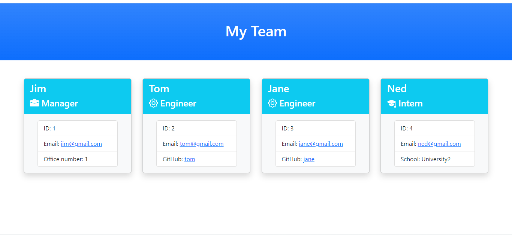

# Engineering Team Profile

## Description

A command-line application that takes in information about employees on a software engineering team using the [Inquirer package](https://www.npmjs.com/package/inquirer/v/8.2.4) and generates an HTML webpage that displays the information for each employee.

After the input of the team manager's name, ID, email, and office number, the user is presented with a menu with the option to add an engineer, an intern, or finish building the team. For the engineer, the name, ID, email, and GitHub username will be collected and then the user will be taken back to the menu. For the intern, the name, ID, email, and school will be collected and then the user will be taken back to the menu.

When the user clicks on finish building the team, the user exits the application and the HTML is generated.

When the email address in the HTML is clicked, the default email program opens and populates the TO field of the email with the address. When the GitHub username is clicked, the GitHub profile opens in a new tab. 

## Usage

This application is invoked by using the following command:
``` 
node index.js
```

## Visuals



## Walkthrough Video

Use the link below to view a walkthrough of this application.

https://drive.google.com/file/d/1_IJZwNqhrA_7Wcx9Ipxg7PLBd0dDaQ9O/view?usp=share_link

If the video is blurry, download the video.

## Tests

This application uses [Jest](https://www.npmjs.com/package/jest) for running the tests.
The tests can be invoked by using the following command:
```
npm run test
```

## Questions

Feel free to contact me at jennyhawes24@gmail.com or look at my [Github](https://github.com/JenniferKiesler).